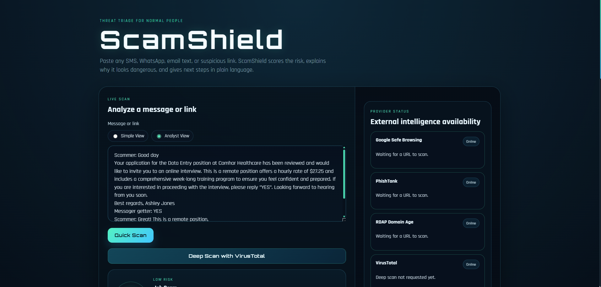
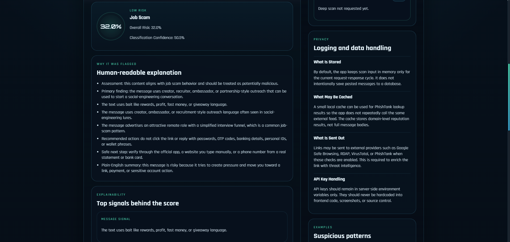
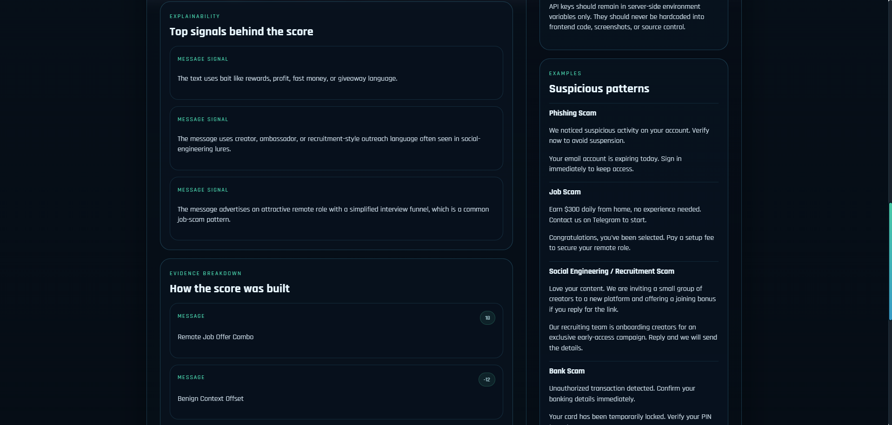
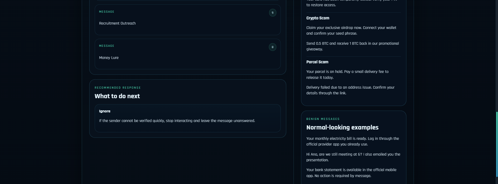
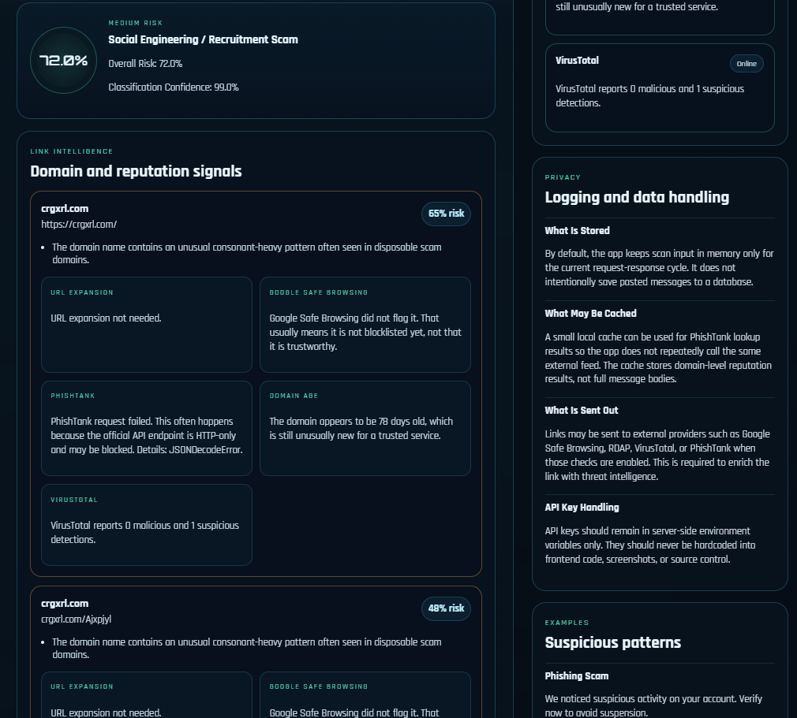

# ScamShield

ScamShield is a Flask-based scam triage app for pasted SMS, WhatsApp, email text, and suspicious links.
It answers one practical question:

`Is this message or link likely to be a scam?`

The app combines message analysis, URL heuristics, and optional threat-intelligence lookups to return:

- overall risk
- classification confidence
- plain-language explanation
- recommended next steps
- analyst-facing evidence and indicators

## Highlights

- Message classification across phishing, bank, crypto, parcel, job, and recruitment-style scams
- URL extraction and domain heuristics
- Typo-squatting, suspicious TLD, path, and short-link analysis
- Domain-age checks with RDAP
- Google Safe Browsing, PhishTank, and optional VirusTotal enrichment
- Simple View and Analyst View
- Explainability, evidence breakdown, IOC extraction, and provider status
- Privacy-aware handling notes for pasted user content

## Screenshots

### Overview


### Scan Workflow


### Explanation


### Evidence Breakdown


### Deep Scan


## How It Works

1. A user pastes a suspicious message or link.
2. ScamShield extracts URLs and indicators from the text.
3. The message is scored for social-engineering patterns.
4. Each URL is evaluated with local heuristics and optional external intelligence.
5. Message and link signals are combined into a final risk score.
6. The UI renders risk, confidence, explanation, evidence, and recommended actions.

## Detection Model

ScamShield separates two outputs:

- `Overall Risk`: how dangerous the content appears
- `Classification Confidence`: how confident the app is about the scam family

### Message Signals

The scoring engine looks for patterns such as:

- urgency and fear language
- credential or identity requests
- payment pressure
- brand impersonation
- off-platform contact pushes
- recruitment and creator-outreach lures
- crypto promotion and advance-fee behavior
- reply-first conversation funnels

### Link Signals

The URL engine evaluates:

- suspicious keywords
- typo-squatting and lookalike domains
- punycode and shortened links
- domain structure and path risk
- suspicious TLDs
- domain age
- reputation-provider results

## Architecture

Core project files:

- `app.py` - scoring engine, enrichment logic, and Flask routes
- `templates/index.html` - main UI template
- `static/style.css` - UI styling
- `tests/data/sample_messages.json` - labeled scam and benign dataset
- `tests/run_dataset.py` - local dataset evaluator

## Setup

Create a `.env` file in the project root:

```env
GOOGLE_API_KEY=your_google_safe_browsing_key
PHISHTANK_API_KEY=your_phishtank_key
VT_API_KEY=your_virustotal_key
APP_USER_AGENT=ScamShield/1.0 security scanner
PHISHTANK_CACHE_HOURS=12
PHISHTANK_MAX_CACHE_ITEMS=5000
```

Keep `.env` out of Git.

Run the app:

```powershell
.\venv\Scripts\python.exe app.py
```

## Dataset Testing

ScamShield includes a labeled dataset for tuning and regression checks.

Run:

```powershell
.\venv\Scripts\python.exe tests\run_dataset.py
```

The evaluator reports:

- category matches
- risk-band matches
- individual mismatches for tuning

## Privacy Notes

- Full pasted messages are processed in memory for the current request.
- The app does not intentionally persist full message bodies to a database.
- PhishTank cache stores domain-level lookup results, not full messages.
- URLs may be sent to external providers when enrichment is enabled.
- API keys remain server-side and should never be committed to source control.

## Limitations

- External providers can fail, rate-limit, or be unavailable.
- Reputation feeds can miss new scam domains.
- Message classification is heuristic and rule-based.
- Results should support triage, not replace independent verification.

## Skills Demonstrated

This project demonstrates:

- phishing and scam triage thinking
- detection logic and weighted scoring
- explainable risk decisions
- graceful handling of external-provider failures
- security UX for non-technical users
- practical tuning with a labeled dataset
