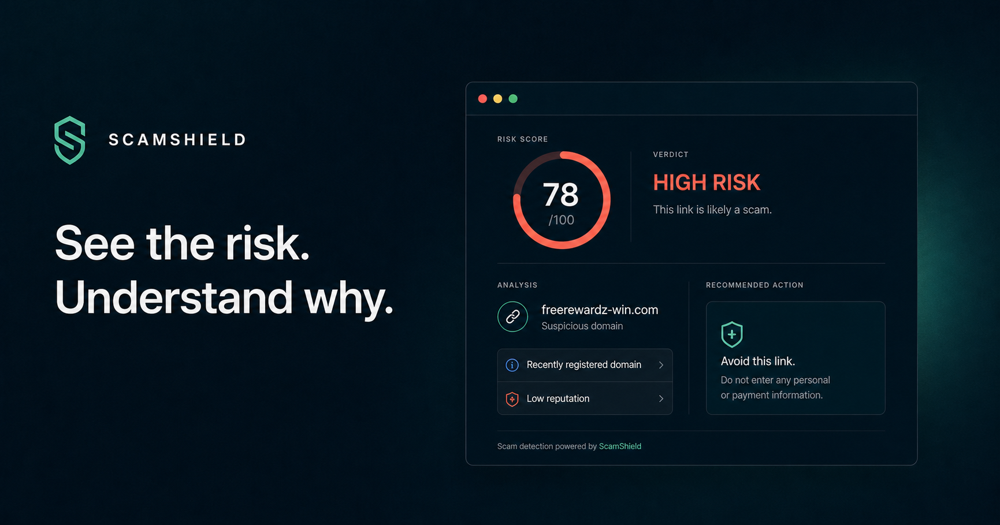

# ScamShield

ScamShield is a web application for reviewing suspicious messages and links before a user clicks, replies, pays, or shares sensitive information. It combines local detection rules with optional reputation services and presents the result as an explainable risk assessment rather than a simple safe/unsafe label.

[Live demo](https://scam.shield-security.workers.dev/)



## Overview

Most scam checkers return a verdict with little context. ScamShield is built around the opposite approach: show the risk score, identify the behavior that influenced it, and give the user a practical next step.

A scan can include:

- a 0–100 risk score and risk band
- the most likely scam pattern
- detected social-engineering signals
- URL structure and domain-age findings
- reputation-provider coverage and status
- extracted URLs, domains, email addresses, phone numbers, and wallet addresses
- a concise set of recommended actions

## Quick Scan and Deep Scan

| Mode | Intended use | Checks |
| --- | --- | --- |
| Quick Scan | Routine messages and links | Message patterns, URL structure, domain age, and Google Safe Browsing when configured |
| Deep Scan | Cases where a link is the main concern | Everything in Quick Scan plus the latest available VirusTotal report |

ScamShield checks for an existing VirusTotal report first. Submitting a URL for a fresh analysis is a separate action and requires explicit consent. URLs containing access tokens, session identifiers, or similar credentials are sanitized before external checks unless the user separately consents to exact URL sharing.

## How the analysis works

1. The input is normalized and URLs and indicators are extracted.
2. Message text is evaluated for urgency, impersonation, credential requests, payment pressure, recruitment lures, and other social-engineering patterns.
3. URLs are checked for suspicious structure, Punycode, IP-based hosts, shorteners, risky paths, unusual domains, and registration age.
4. Configured reputation providers add external evidence without replacing the local analysis.
5. The signals are combined into a weighted score with an evidence trail and recommended response.

Unavailable providers are reported as unavailable. They are never treated as a clean result.

## Technology

| Area | Implementation |
| --- | --- |
| Interface | React, TypeScript, responsive CSS, dark and light themes |
| Application framework | Vinext with Next-compatible App Router components |
| Runtime | Cloudflare Workers |
| Threat intelligence | Google Safe Browsing, RDAP, VirusTotal |
| Abuse protection | Cloudflare Turnstile and globally consistent Durable Object rate limits |
| Testing | Node test runner, TypeScript checks, production build tests |

## Run locally

Requirements:

- Node.js 22.13 or newer
- pnpm

```powershell
git clone https://github.com/EmanPalavra/ScamShield.git
cd ScamShield/cloudflare-app
pnpm install
Copy-Item .env.example .env.local
pnpm run dev
```

The development URL is printed in the terminal. From the repository root, `python app.py` starts the same application and can be used as a convenience launcher.

### Environment variables

All variables are optional for local development. Missing provider credentials disable only the related live check.

| Variable | Purpose | Exposure |
| --- | --- | --- |
| `GOOGLE_API_KEY` | Google Safe Browsing requests | Server secret |
| `VIRUSTOTAL_API_KEY` | Existing reports and consent-based submissions | Server secret |
| `STATUS_SIGNING_KEY` | Signs short-lived VirusTotal polling tokens | Server secret |
| `RATE_LIMIT_SIGNING_KEY` | HMAC-signs daily rotating, non-reversible rate-limit buckets | Server secret |
| `TURNSTILE_SITE_KEY` | Renders the Turnstile widget | Public |
| `TURNSTILE_SECRET_KEY` | Validates Turnstile tokens | Server secret |
| `DISABLE_EXTERNAL_CHECKS` | Disables provider calls during tests | Local/test only |

Production secrets should be stored with Cloudflare and must not be committed to the repository.
Use a dedicated random `RATE_LIMIT_SIGNING_KEY` of at least 32 bytes. If it is absent, ScamShield can reuse another sufficiently strong server-only secret with domain-separated HMAC input; a dedicated key remains the recommended production setup.

## Validation

Run these commands from `cloudflare-app/`:

```powershell
pnpm run lint
pnpm run typecheck
pnpm test
```

The test suite covers public page rendering, security headers, scan behavior, global rate-limit behavior, provider fallbacks, request validation, private-URL protection, signed polling, and the transparency pages.

### Scoring evaluation

The local message score can be measured against the user-collected samples, the UCI SMS Spam Collection, and
SpaPhish v5:

```powershell
pnpm run evaluate:download
pnpm run evaluate
pnpm run evaluate:holdout
pnpm run evaluate:train-model
pnpm run evaluate:final-holdout
```

Raw corpus messages stay local and are excluded from Git. The primary independent performance report is
[`cloudflare-app/evaluation/FINAL_HOLDOUT.md`](cloudflare-app/evaluation/FINAL_HOLDOUT.md).
[`cloudflare-app/evaluation/FROZEN_HOLDOUT.md`](cloudflare-app/evaluation/FROZEN_HOLDOUT.md) records the pre-model
benchmark and is no longer unseen because its sources were subsequently used for model training.
[`cloudflare-app/evaluation/BASELINE.md`](cloudflare-app/evaluation/BASELINE.md) is a development regression report,
not an independent estimate.

## Security and privacy

- Provider credentials remain in the Worker environment and are not returned to the browser.
- Request bodies and URL counts are bounded before analysis.
- Private, local, reserved, and credential-bearing destinations are not sent to external providers. Sensitive query values are removed by default; sharing the complete tokenized URL requires a separate explicit opt-in.
- Cross-site writes, unsupported methods, and unexpected content types are rejected.
- Scan quotas use sharded, SQLite-backed Cloudflare Durable Objects. Client IPs are transformed with a server-secret HMAC and a daily rotation boundary, so raw IPs and enumerable unsalted hashes are not used as bucket identifiers.
- Fresh VirusTotal submissions require explicit consent and a valid Turnstile token when Turnstile is enabled.
- Submitted message text is processed for the request and is not intentionally stored in an application database.
- The compact statistical message model runs locally inside the Worker; it does not send message text to an AI API.

URLs may be shared with configured reputation providers. The interface identifies when a check uses an external service.

## Limitations

ScamShield is a triage tool, not a guarantee. New domains may not yet appear in reputation feeds, legitimate messages can contain suspicious language, and targeted scams can avoid known patterns. Financial requests, login prompts, and identity checks should still be verified through an independently found official channel.

## Repository structure

```text
ScamShield/
├── app.py                         # Optional local launcher
├── README.md
└── cloudflare-app/
    ├── app/                       # Interface and information pages
    ├── public/                    # Favicon and social preview image
    ├── tests/                     # Regression and security tests
    ├── worker/                    # Worker entry point and scan engine
    ├── package.json
    └── vite.config.ts
```

## Deployment

Build and deploy from `cloudflare-app/`:

```powershell
pnpm run build
pnpm run deploy
```

The public deployment is available at [scam.shield-security.workers.dev](https://scam.shield-security.workers.dev/).
