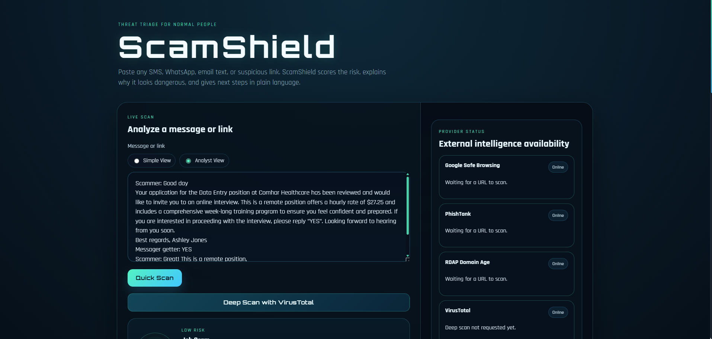
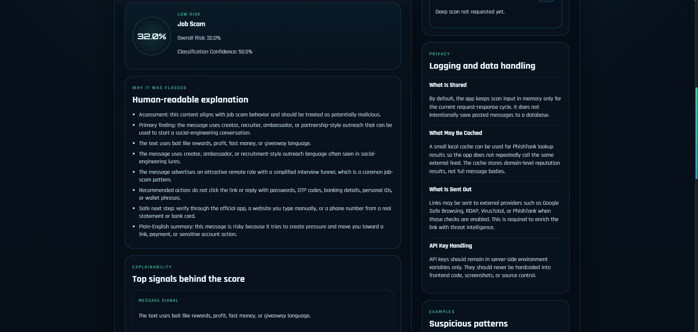
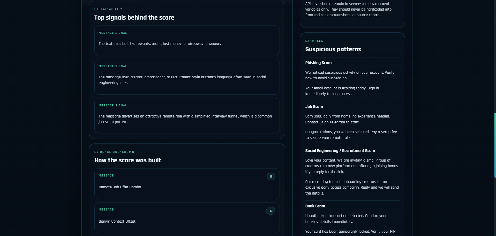
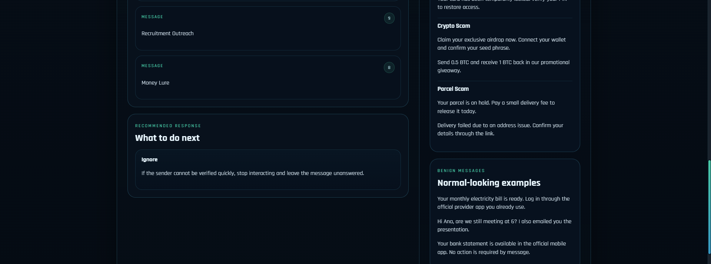
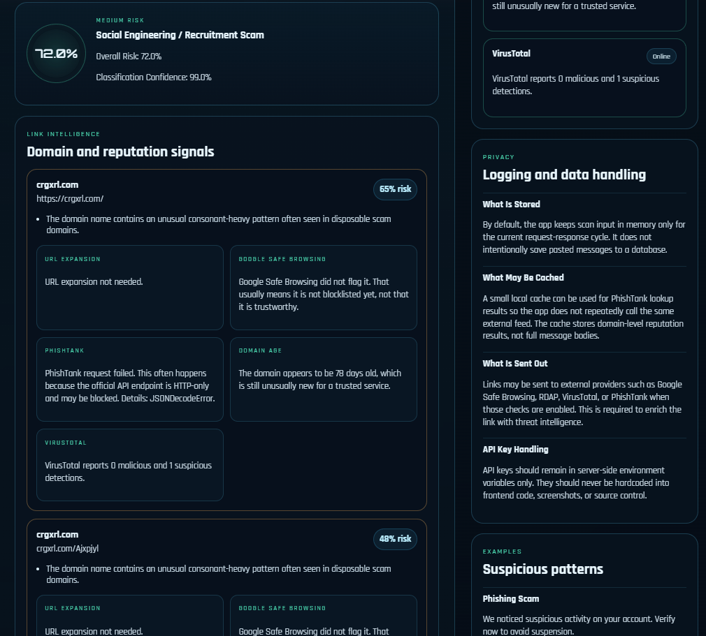

# ScamShield

ScamShield is an explainable scam-triage app for pasted SMS, WhatsApp, email text, and suspicious links. The repository now contains the original Flask implementation and a Cloudflare Worker production application under `cloudflare-app/`.
It answers one practical question:

`Is this message or link likely to be a scam?`

The app combines message analysis, URL heuristics, and optional threat-intelligence lookups to return:

- overall risk
- classification confidence
- plain-language explanation
- recommended next steps
- analyst-facing evidence and indicators

## Highlights

- Message classification across phishing, bank, crypto, parcel, job, and recruitment-style scams
- URL extraction and domain heuristics
- Typo-squatting, suspicious TLD, path, and short-link analysis
- Domain-age checks with RDAP
- Google Safe Browsing, PhishTank, and optional VirusTotal enrichment
- Independent Quick Scan and Deep Scan actions (Deep Scan does not require a prior Quick Scan)
- Consent-based fresh VirusTotal analysis with result polling
- Parallel provider calls with time budgets and short-lived caching
- Cloudflare Turnstile integration, per-client rate limits, secure headers, and `/health`
- Simple View and Analyst View
- Explainability, evidence breakdown, IOC extraction, and provider status
- Privacy-aware handling notes for pasted user content

## Screenshots

### Overview


### Scan Workflow


### Explanation


### Evidence Breakdown


### Deep Scan


## How It Works

1. A user pastes a suspicious message or link.
2. ScamShield extracts URLs and indicators from the text.
3. The message is scored for social-engineering patterns.
4. Each URL is evaluated with local heuristics and optional external intelligence.
5. Message and link signals are combined into a final risk score.
6. The UI renders risk, confidence, explanation, evidence, and recommended actions.

## Detection Model

ScamShield separates two outputs:

- `Overall Risk`: how dangerous the content appears
- `Classification Confidence`: how confident the app is about the scam family

### Message Signals

The scoring engine looks for patterns such as:

- urgency and fear language
- credential or identity requests
- payment pressure
- brand impersonation
- off-platform contact pushes
- recruitment and creator-outreach lures
- crypto promotion and advance-fee behavior
- reply-first conversation funnels

### Link Signals

The URL engine evaluates:

- suspicious keywords
- typo-squatting and lookalike domains
- punycode and shortened links
- domain structure and path risk
- suspicious TLDs
- domain age
- reputation-provider results

## Architecture

Production project files:

- `cloudflare-app/app/` - public interface and transparency pages
- `cloudflare-app/worker/scanner.ts` - Cloudflare-native scanning API, provider orchestration, consent flow, and limits
- `cloudflare-app/worker/index.ts` - Worker entry point and response security headers
- `cloudflare-app/tests/rendered-html.test.mjs` - production route and API regression tests

Original Flask project files:

- `app.py` - scoring engine, enrichment logic, and Flask routes
- `templates/index.html` - main UI template
- `static/style.css` - UI styling
- `tests/data/sample_messages.json` - labeled scam and benign dataset
- `tests/run_dataset.py` - local dataset evaluator

## Setup

Create a `.env` file in the project root:

```env
GOOGLE_API_KEY=your_google_safe_browsing_key
PHISHTANK_API_KEY=your_phishtank_key
VT_API_KEY=your_virustotal_key
APP_USER_AGENT=ScamShield/1.0 security scanner
PHISHTANK_CACHE_HOURS=12
PHISHTANK_MAX_CACHE_ITEMS=5000
MAX_MESSAGE_LENGTH=10000
MAX_URLS_PER_SCAN=5
ENABLE_SHORT_URL_EXPANSION=false
ALLOW_INSECURE_PHISHTANK=false
QUICK_SCAN_RATE_LIMIT=20
DEEP_SCAN_RATE_LIMIT=5
```

Keep `.env` out of Git.

Install the pinned dependencies:

```powershell
python -m pip install -r requirements.txt
```

Run the app:

```powershell
.\venv\Scripts\python.exe app.py
```

## Production Deployment

The recommended production surface is `cloudflare-app/`. It runs as a Cloudflare Worker, does not require an always-on server process, and includes the public UI, API routes, secure headers, request limits, caching, and health check.

Required hosted variables for full functionality:

```env
GOOGLE_API_KEY=...
VIRUSTOTAL_API_KEY=...
TURNSTILE_SITE_KEY=...
TURNSTILE_SECRET_KEY=...
```

`TURNSTILE_SITE_KEY` is public configuration; the other values must be stored as hosted secrets. If provider keys are absent, ScamShield reports those checks as unavailable instead of treating them as clean.

The Flask version remains deployable through the included `render.yaml` and `Procfile` when a traditional Python host is preferred.

To publish the Flask version on Render:

1. Push the repository to GitHub.
2. In Render, create a new Blueprint and select this repository.
3. Add `GOOGLE_API_KEY` and `VT_API_KEY` as secret environment variables if those providers should be enabled.
4. Deploy and verify `/health` returns `{"status":"ok"}`.

PhishTank's documented direct lookup endpoint uses unencrypted HTTP, so direct lookups are disabled by default. Keep `ALLOW_INSECURE_PHISHTANK=false` for public deployments and use a safely maintained local feed/cache instead.

## Dataset Testing

ScamShield includes a labeled dataset for tuning and regression checks.

Run:

```powershell
.\venv\Scripts\python.exe tests\run_dataset.py
```

The evaluator reports:

- category matches
- risk-band matches
- individual mismatches for tuning

## Privacy Notes

- Full pasted messages are processed in memory for the current request.
- The app does not intentionally persist full message bodies to a database.
- PhishTank cache stores domain-level lookup results, not full messages.
- URLs may be sent to external providers when enrichment is enabled.
- API keys remain server-side and should never be committed to source control.

## Limitations

- External providers can fail, rate-limit, or be unavailable.
- Google Safe Browsing is intended for non-commercial use; revenue-generating deployments should use Google Web Risk instead.
- Reputation feeds can miss new scam domains.
- Message classification is heuristic and rule-based.
- Results should support triage, not replace independent verification.

## Skills Demonstrated

This project demonstrates:

- phishing and scam triage thinking
- detection logic and weighted scoring
- explainable risk decisions
- graceful handling of external-provider failures
- security UX for non-technical users
- practical tuning with a labeled dataset
